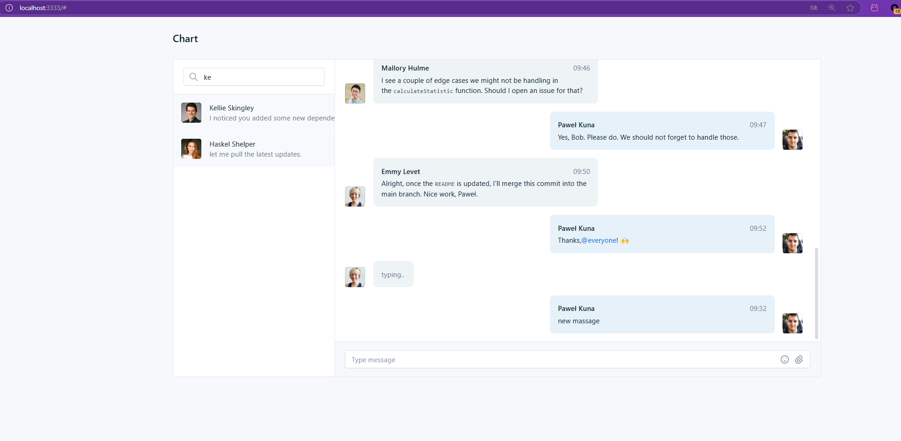

A simple example, for demonstration purposes. Copy and paste the HTML :) .
It uses [tabler](https://preview.tabler.io/chat.html), and you can find the original
version in the chat.html file under the table template.

```
sbt ~fastLinkJS
pnpm install
pnpm run dev
```


