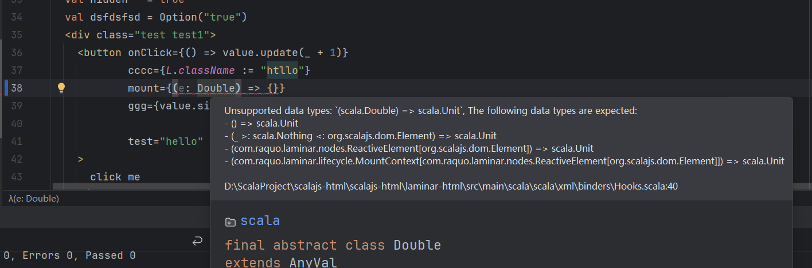

# Laminar-html

[English](readme_en.md)

为Laminar提供 XHTML 语法支持, 通过scala的xml字面量创建Laminar节点. 

注意: 
1. 该库跟scala-xml是不兼容的
2. html允许一些标签不需要手动闭合, 但是XML要求所有标签必须闭合

Invalid:

```xhtml
<br>

<input type="text" name="username">
```

Valid:

```xhtml
<br />

<input type="text" name="username" />
```


# 使用

```scala
"io.github.elgca" %%% "laminar-html" % "0.2.0"
```

- 具备跟Laminar的完全互操作性
  - 可以将XHTML、Laminar自由的组合在一起:
    - `<button> {L.onClick --> count.update(_ + 1)} </button>`
    - `L.div(<button onclick={() => println("clicked")} />)`
    - `<div>{L.button(L.onClick --> println("clicked"))}</div>`
- Var[x]/Source[x]存储状态事件, 可以作为属性/子节点绑定到xhtml

```scala
val xhtmlElem = {
  val count = Var(0)
  <div>
    <h1 class="title">Hello World</h1>
    <button 
      class="btn btn-primary"
      onclick={() => count.update(_ + 1) }
    >
      xHtml Button
    </button>
    <p>Count: {count}</p> {/* Source[x] use as a child node */}
    {
      // this is a laimianr node.This is great, isn't it?
      L.button(
        className := "btn btn-primary",
        onClick --> count.update(_ + 1),
        "Laminar Button"
      )
    }
  </div>
}

val laminarElem = {
  L.div(
    "laminar element",
    xhtmlElem 
  )
}

// L.renderOnDomContentLoaded(document.getElementById("app"), xhtmlElem)
L.renderOnDomContentLoaded(document.getElementById("app"), laminarElem)
```

## 编译时类型检查校验

- 0.2.0开始,使用scala3的宏对属性节点进行处理,编译期间检查Events、htmlProp、htmlAttr参数类型
- 根据属性key提供更精确的类型类型判断, 例如: value只接收string,checked只接收bool
- 关闭/开启类型提示: build.sbt中配置 `val _ = System.setProperty("show_type_hints", "true")`

异常类型提示:


类型信息提示:


## onmount/onunmount生命周期事件属性 

属性名不区分大小写,所以可以写如果愿意可以使用例如: onMount/onUnmount

```scala
val element = () => {
  val chart:Option[Chart] = None
  <div
      class="container"
      onmount={(ref:dom.Element) => {chart = initChart(ref)} }
      onunmount={() => chart.foreach(_.destory())}
  />
}
```

