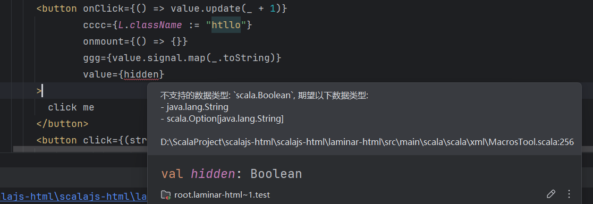

# Laminar-html

[English](readme_en.md)

为Laminar提供 XHTML 语法支持, 通过scala的xml字面量创建Laminar节点. 

注意: 该库跟scala-xml是不兼容的

- 0.2.0开始,使用scala3的对xml字面量中的宏进行处理

# example

一个简单的示例, 为了演示如何使用. 复制黏贴html :) .
使用了[tabler](https://preview.tabler.io/chat.html), 你可以在`table template`的chat.html中找到原始版本.

有时候copy的html会出现错误, 由于严格的xml/xhtml语法,这个错误通常来自未闭合标签.

无效:
```xhtml
<br>

<input type="text" name="username">
```

有效:
```xhtml
<br />

<input type="text" name="username" />
```

启动示例

```shell

cd example
sbt ~fastLinkJS
npm install
npm run dev
```


# 使用

```scala
"io.github.elgca" %%% "laminar-html" % "0.2.0"
```

- 所有的节点都是Laminar的ReactiveElement.Base所以具备跟Laminar的完全互操作性.
- 可以使用Laminar中所有的属性、事件和子节点, 例如: `<button> {L.onClick --> count.update(_ + 1)} </button>`
- 支持Airstream中所有的反应式变量
- 你可以把xhtml嵌入到Laminar的节点中或者把Laminar的节点嵌入到xhtml中

示例1:

```scala
val xmlElem = {
  val count = Var(0)
  <div>
    <h1 class="title">Hello World</h1>
    <button 
      class="btn btn-primary"
      onclick={() => count.update(_ + 1) }
    >
      <!-- 事件函数会调用dom的addEventListener添加事件监听-->
      <!-- 参考 https://developer.mozilla.org/zh-CN/docs/Web/API/Element/click_event-->
      Html Button
    </button>
    <p>Count: {text <-- count}</p>
    L.button( // 在xml中嵌入Laminar节点
      className :="btn btn-primary",
      onClick --> count.update(_ + 1),
      "Laminar Button"
    )
  </div>
}

val laminarElem = {
  L.div(
    "laminar element",
    xmlElem // 把xml嵌入到laminar中
  )
}

L.renderOnDomContentLoaded(document.getElementById("app"), laminarElem)
```

示例2

```scala
import com.raquo.laminar.api.L.*
import org.scalajs.dom

@main def hello = {
  def onTrue        = {
    println("创建了新的onTrue")
    <div>
      <h1>这是True</h1>
      {
        onMountUnmountCallback(
          mount = { _ => println("mounted:这是True") },
          unmount = { _ => println("unmounted:这是True") })
      }
    </div>
  }
  def onFalse       = {
    println("创建了新的onFalse")
    <div>
      <h1>这是False</h1>
      {
        onMountUnmountCallback(
          mount = { _ => println("mounted:这是False") },
          unmount = { _ => println("unmounted:这是False") })
      }
    </div>
  }
  val switch        = Var(true)
  val switchElement = switch.signal.map(if (_) onTrue else onFalse)
  val zipVar        = Var("")

  val app = {
    <div>
      <input
        placeholder ="Enter zip code: "
        class ="input input-primary"
        value = {zipVar}
        input = {(e: String) => zipVar.set(e.data.filter(_ != 'a'))}
      />
      <button onclick={() => switch.set(!switch.now())}>Change</button>
      {switchElement}
    </div>
  }

  val _ = render(dom.document.getElementById("app"), app)
}
```

## 事件函数

事件通过`element.addEventListener`绑定, 这意味着重复设置监听器都会生效。
所有'onxxx'将被映射为 'xxx'的事件 ,提供下列函数支持:

- `() => Unit`
- `(e: Ev <: dom.Event) => Unit`
- `(value:String) => Unit`
  - 等效于 `(e: dom.Event) => f(e.target.value.getOrElse(""))`
- `(checked:Boolean) => Unit`
  - 等效于 `(e: dom.Event) => f(e.target.checked.getOrElse(false))`
- `(files:List[dom.File]) => Unit`
  - 等效于 `(e: dom.Event) => f(e.target.files.getOrElse(List.empty))`

支持通过Rx变量的设置监听函数 `Source[ListenerFunction]`,当监听函数变更时候, 会自动替换掉之前的监听函数。

# 0.2.0 变更 [工作中...]


- 使用宏处理属性设置,根据属性key提供更精确的类型类型判断
  - 例如: onclick只能支持事件函数, value只接收string,checked只接收bool
  - 基于`Locale.getDefault`判断提示语言目前支持: 中文/英文
  - 已经提供类型判断, 参考Laminar的定义 `HtmlProps/HtmlAttrs/SvgAttrs/ComplexHtmlKeys`
  - 未定义的dom属性只支持string
- 增加mount/unmount事件注册
  - 例如: `<div mount={(ref:dom.Element) => {chart =  Chart(ref)} } />`
  - mount属性名, 不区分大小写: mount/onmount 
  - unmount属性名, 不区分大小写: unmount/onunmount
- 提供任意属性名,其值可以是Laminar的Modifier
  - 例如: `<div lamianrMod={L.onClick --> { println("onclick") }} />`
- Var/Signal在插入将作为`child <-- Var`处理
  - 例如: `val cnt=Var(0); val elem = <div><button onClick={() => cnt.update(_ + 1)} /> Count: {cnt} <div/>`


类型异常提示示例:



