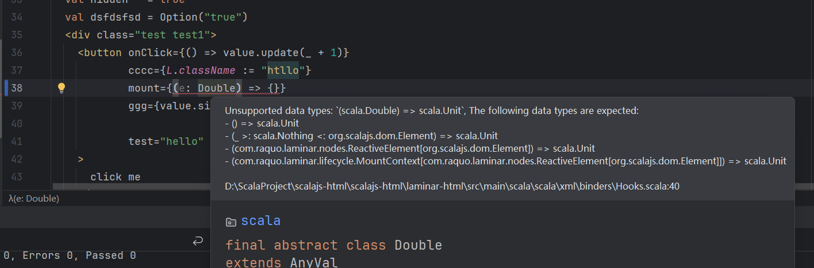
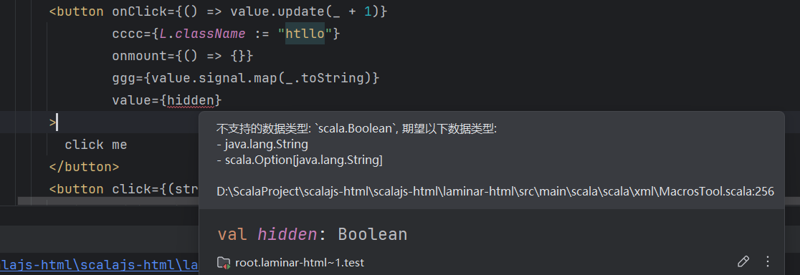

# Laminar-html

[中文](readme.md)

Provides XHTML syntax support for Laminar, creating Laminar nodes through Scala's XML literals.

Note: This library is incompatible with scala-xml


# example

A simple example, for demonstration purposes. Copy and paste the HTML :) . 
It uses [tabler](https://preview.tabler.io/chat.html), and you can find the original 
version in the chat.html file under the table template.

Sometimes, the copied HTML may contain errors,
usually due to the strict XML/XHTML syntax.
These errors often stem from unclosed tags.

Invalid:

```xhtml
<br>

<input type="text" name="username">
```

Valid:

```xhtml
<br />

<input type="text" name="username" />
```

start

```shell

cd example
sbt ~fastLinkJS
npm install
npm run dev
```


# usage

```scala
"io.github.elgca" %%% "laminar-html" % "0.1.6"
```

- All nodes are `ReactiveElement.Base` so they are fully interoperable with Laminar.
- All Laminar attributes, events and child nodes can be used, for example: `<button> {L.onClick --> count.update(_ + 1)} </button>`
- All Airstream reactive variables are supported
- You can embed xhtml into Laminar nodes and vice versa

示例1:

```scala
val xmlElem = {
  val count = Var(0)
  <div>
    <h1 class="title">Hello World</h1>
    <button 
      class="btn btn-primary"
      click={() => count.update(_ + 1) }
    >
      <!-- 事件函数会调用dom的addEventListener添加事件监听-->
      <!-- 参考 https://developer.mozilla.org/zh-CN/docs/Web/API/Element/click_event-->
      Html Button
    </button>
    <p>Count: {text <-- count}</p>
    L.button( // 在xml中嵌入Laminar节点
      className :="btn btn-primary",
      onClick --> count.update(_ + 1),
      "Laminar Button"
    )
  </div>
}

val laminarElem = {
  L.div(
    "laminar element",
    xmlElem // 把xml嵌入到laminar中
  )
}

L.renderOnDomContentLoaded(document.getElementById("app"), laminarElem)
```

示例2

```scala
import com.raquo.laminar.api.L.*
import org.scalajs.dom

@main def hello = {
  def onTrue        = {
    println("创建了新的onTrue")
    <div>
      <h1>这是True</h1>
      {
        onMountUnmountCallback(
          mount = { _ => println("mounted:这是True") },
          unmount = { _ => println("unmounted:这是True") })
      }
    </div>
  }
  def onFalse       = {
    println("创建了新的onFalse")
    <div>
      <h1>这是False</h1>
      {
        onMountUnmountCallback(
          mount = { _ => println("mounted:这是False") },
          unmount = { _ => println("unmounted:这是False") })
      }
    </div>
  }
  val switch        = Var(true)
  val switchElement = switch.signal.map(if (_) onTrue else onFalse)
  val zipVar        = Var("")

  val app = {
    <div>
      <input
        placeholder ="Enter zip code: "
        class ="input input-primary"
        value = {zipVar}
        input = {(e: String) => zipVar.set(e.data.filter(_ != 'a'))}
      />
      <button click={() => switch.set(!switch.now())}>Change</button>
      {switchElement}
    </div>
  }

  val _ = render(dom.document.getElementById("app"), app)
}
```

## 事件函数

Events are bound via `element.addEventListener`, which means that repeated settings of listeners will take effect.
All 'onxxx' will be mapped to 'xxx', providing the following function support:

- `() => Unit`
- `(e: Ev <: dom.Event) => Unit`
- `(value:String) => Unit`
  - Equal `(e: dom.Event) => f(e.target.value.getOrElse(""))`
- `(checked:Boolean) => Unit`
  - Equal `(e: dom.Event) => f(e.target.checked.getOrElse(false))`
- `(files:List[dom.File]) => Unit`
  - Equal `(e: dom.Event) => f(e.target.files.getOrElse(List.empty))`

Supports setting the listener function `Source[ListenerFunction]` through Reactive variables.
When the listener function changes, the previous listener function will be automatically replaced.

# 0.2.0 Changes [working...]

- Use macro processing for attribute settings, providing more precise type judgment based on attribute keys.
  - For example: `onclick` only supports event functions, `value` only accepts string, `checked` only accepts `bool`.
  - Language detection based on Locale.getDefault, currently supporting Chinese and English.
  - Type judgment has been provided, referring to Laminar's definitions of `HtmlProps/HtmlAttrs/SvgAttrs/ComplexHtmlKeys`
  - Undefined Html attributes only support string
- Added registration for mount/unmount events.
  - For example: `<div mount={(ref:dom.Element) => {chart =  Chart(ref)} } />`
  - Mount attribute names, Case-insensitive:  mount/onmount
  - Unmount attribute names, Case-insensitive:  unmount/onunmount
- Arbitrary attribute names are supported, with values that can be Laminar's Modifier.
  - For example: `<div laminarMod={L.onClick --> { println("click") }} />`
- Var/Signal, when inserted as a child mean `child <-- Var`
  - For example: `val cnt=Var(0); val elem = <div><button onClick={() => cnt.update(_ + 1)} /> Count: {cnt} <div/>`

Example of type error hints:



